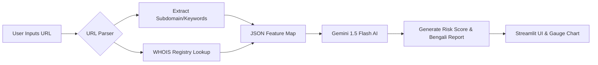

# 🛡️ SafeNet BD: AI Phishing Shield


> A next-generation, AI-powered Cyber Security tool designed specifically to protect Bangladeshi users from sophisticated phishing attacks (Fake bKash offers, Daraz clones, Govt Job scams).

## ✨ Premium Enterprise Features
- **Homograph Attack Detection (Punycode):** Catches extremely sophisticated visual spoofing where scammers use Cyrillic or Greek letters that look identical to English (e.g., bкash vs bkash).
- **Redirect Unmasking:** Chases shorteners (e.g., bit.ly) or sneaky redirects to find the actual destination URL before scanning.
- **Deep SSL Inspection:** Goes beyond simple `https://` checking. Actually connects via socket to extract the exact SSL Certificate Issuer to verify authenticity.
- **DOM Content Scraping:** Fetches the actual HTML title and meta descriptions of the target site so the AI can verify if a site claiming to be "bKash" actually has bKash context.
- **Deterministic WHOIS Scanning:** Automatically resolves Domain Registration Age and Registrar info to catch freshly registered scam domains with explicit timeout thread-protection.
- **Gemini AI Threat Analyst:** Combines the hard metrics (WHOIS, SSL, DOM, Homograph) and feeds them into a strict AI prompt to evaluate the semantic intent of the URL.
- **Cyber-Themed Dashboard:** Dark-mode Streamlit UI with Plotly interactive Gauge Charts indicating Risk Level (0-100%).

## 🏗️ Architecture



## 🚀 Setup & Execution

### 1. Requirements
Ensure you have a [Google Gemini API Key](https://aistudio.google.com/).
Create a `.env` file in the root directory:
```env
GEMINI_API_KEY=your_api_key_here
```

### 2. Installation
```bash
git clone https://github.com/almuzahidseyam/SafeNet-Phishing-Shield.git
cd SafeNet-Phishing-Shield
python -m venv venv
source venv/bin/activate
pip install -r requirements.txt
```

### 3. Run the Shield
```bash
streamlit run app.py
```
